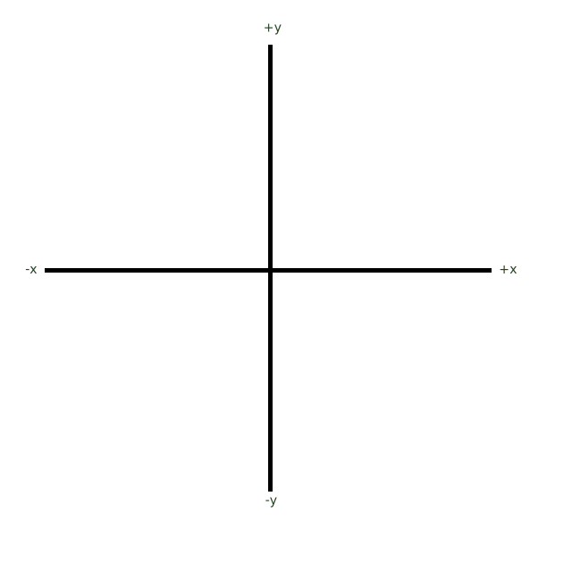
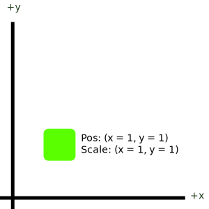
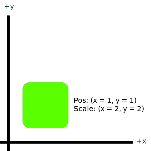
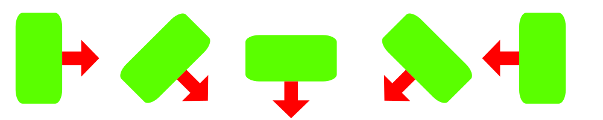

Documentation
======================================================
The majority of features are described thoroughly through the written & generated API section, but some concepts are hard to define when restricted to classes, functions or members. This page attempts to fill in the gaps by describing the core design concepts of Tristeon in-depth.

Our goal with this page is to provide thorough transparency in how Tristeon operates and what behaviour you can expect across the board.

Transformations
^^^^^^^^^^^^^^^^^^^^
Tristeon is a 2D game engine, meaning that objects, environment, sound, lights, and all other things are in some way located on a two-dimensional transformation grid. Tristeon, like many others, uses the cartesian coordinate system to describe an object's location, rotation, scale, movement, etc.

| **Cartesian Coordinates**
| The cartesian coordinate system in Tristeon describes a 2D grid, using axes labeled x and y. The x-axis is the horizontal axis, allowing objects to move left and right across the world. The y-axis on the other hand, is the vertical axis, which allows objects to move up and down in the world. The coordinate system used in Tristeon specifically defines that negative x (-x) is left and positive x (+x) is right. For the y-axis, negative y (-y) is down and positive y (+y) is up. This is illustrated below:

| **Origin**
| The central point, where both the axes connect, is called the **origin** and this point is located at (x = 0, y = 0).

===============
Position
===============

Positions are points on the cartesian coordinate system. In Tristeon, these points are represented by the :ref:`Vector` class. Objects can have a position and can be moved by changing the x and/or y value of their position, meaning that for example to move an object right over time, one simply needs to increase the object's x position every frame.
Illustrated below is a point or position on Tristeon's 2D coordinate system:

.. image:: images/Point.svg

===============
Scale
===============

Scaling in Tristeon follows the very same two-dimensional system to describe the size of an object along the x-axis and y-axis (and thus is represented by the :ref:`Vector` class). An object's scale acts as a multiplier, meaning that if their size is originally defined by e.g. their sprite/image size, the final object's size can be calculated by multiplying the original size by its scale.

Scaling in the x-axis increases the object's size horizontally, scaling in the y-axis increases the object's size vertically. Note that scaling is local to the object, meaning that if an object is rotated 90 degrees, these effects will change accordingly (so in a 90 degree rotation situation, the x axis will actually visually scale the object vertically).

Scale affects the object from its origin point (usually the center), and only ever affects the object's size. Scale can be 0 but this makes the object non-visible. Scale can not be less than 0. An example of object scaling is illustrated below:

===============
Rotation
===============

Rotations can turn objects clockwise or counter-clockwise. Rotations in Tristeon are described using degrees, and are applied in a clockwise direction, meaning that increasing an object's rotation will turn it in the clockwise direction (right). A rotation of 0 describes a neutral or identity rotation which means that the object isn't rotated and the right-pointing vector local to the object points right (`Vector(1, 0)`).

Rotations happen around the object's origin point (usually its center). The image below illustrates an object being rotated at rotation 0, 45, 90, 135, and 180 respectively (left to right). The red arrow indicates the direction of the right-pointing vector local to the object.

Serialization
^^^^^^^^^^^^^^^^^^^^
Tristeon uses a standardized way to store object data across the engine. Our goal with object serialization in Tristeon is to create a homogeneous approach to serialization that is very human-readable and at least somewhat version-control friendly. This section won't cover how exactly all serialization is handled in code but you can read more about that in the serialization API, in classes like :ref:`Serializable`, :ref:`JsonSerializer`, and :ref:`TypeRegister`.

===============
JSON
===============
Tristeon scenes, objects, and other data types are stored using the json format (https://www.json.org/json-en.html). Json is a highly readable format that is easy to modify and fares fairly well with source control. This ofcourse doesn't mean that you have to write the json files yourself, all json data in Tristeon is generated, but modifying it shouldn't pose any additional challenges.

For example, a json representation of an :ref:`Actor` with an :ref:`AmbientLight` behaviour:

.. code-block:: json

    {
        "behaviours": [
            {
                "colour": {
                    "a": 1.0,
                    "b": 1.0,
                    "g": 1.0,
                    "r": 1.0,
                    "typeID": "Tristeon::Colour"
                },
                "instanceID": 1554923456,
                "intensity": 0.5,
                "renderMask": {
                    "typeID": "Tristeon::SerializedEnum<enumTristeon::RenderMask>",
                    "value": 127
                },
                "typeID": "Tristeon::AmbientLight"
            }
        ],
        "instanceID": 2236587147,
        "name": "Ambient",
        "position": {
            "typeID": "Tristeon::VectorType<float>",
            "x": 0.0,
            "y": 0.0
        },
        "rotation": 0.0,
        "scale": {
            "typeID": "Tristeon::VectorType<float>",
            "x": 1.0,
            "y": 1.0
        },
        "typeID": "Tristeon::Actor"
    }

In the example above, the properties are represented using a `"name": value` pattern, each separated by a comma. This can for example be seen in the "name" and "rotation" properties.

A value can also be a nested object itself: `"name": { "x": 0 }`. There are many examples of this within the example above but we'd recommend to take a look at the "position" and "scale" fields because they contain very little extra data, making it easier to get a grasp of the syntax.

Arrays or lists are represented in a similar pattern except they are written like `"name": [ value, value ]` where the space between the brackets can be filled with value entries separated by commas. This can be seen in the "behaviours" field, which is an array of :ref:`Behaviour`. Each element in the array is a separate json object that contains fields and additionally nested objects.

Where some fields are very straight-forward (the :ref:`Actor` 's name for example), others may seem a little less clear (typeID, instanceID), so we'll try to clarify some of the special fields down below.

=====================
Type IDs
=====================
In Tristeon, a lot of types like :ref:`Actor` and :ref:`Behaviour` can be derived from, but they are commonly stored as their base types. So, to be able to create the appropriate derived types in serialization time, Tristeon stores a type-name along each object.

| This is represented by the "typeID" field that we store into each json object. For example a :ref:`Sprite` actor will serialize its typeID as `"typeID": "Tristeon::Sprite"`. The typeID is always the full type's name, including its namespace, with all typedefs deducted and with all templated types shown in place. 
| Some examples are:

=================== ==================================
Type                Resulting typeID
=================== ==================================
Actor               Tristeon::Actor
List<Colour>        Tristeon::List<Tristeon::Colour>
Vector              Tristeon::VectorType<float>
int32_t             int
=================== ==================================

This typeID is used by the :ref:`TypeRegister` to create derived types in runtime. The :ref:`TypeRegister` maps templated factory functions to typeID strings to create the derived types. Read more about how this is handled in detail in the :ref:`TypeRegister` API.

===============
Instance IDs
===============
Instance IDs are unique identifiers that allow us to do very quick lookups for references to other objects in the :ref:`Scene`. In order for an object to have an instance ID, its type needs to inherit from InstancedSerializable at some point in the inheritance tree. Most inheritable classes in Tristeon like :ref:`Actor` and :ref:`Behaviour` already do, so they'll have this built-in. 

An instance's ID is randomly generated upon creation of the object (or loaded from json), and is stored in its json representation. Once set, the instance ID is expected to never change (although there are exceptions in the case of an ID collision). This means that you can safely serialize an object's instance ID as a way to reference it when the :ref:`Scene` is saved. 

The details of the implementation can be found at :ref:`InstancedSerializable`. To be able to do runtime lookups of an object with an instance ID, reference :ref:`InstanceCollector`.

Scenes
^^^^^^^^^^^^^^^^^^^^
===============
Layers
===============

====================
Actors & Behaviours
====================

Asset Management
^^^^^^^^^^^^^^^^^^

Editor
^^^^^^^^^^^^^^^^^^^^
